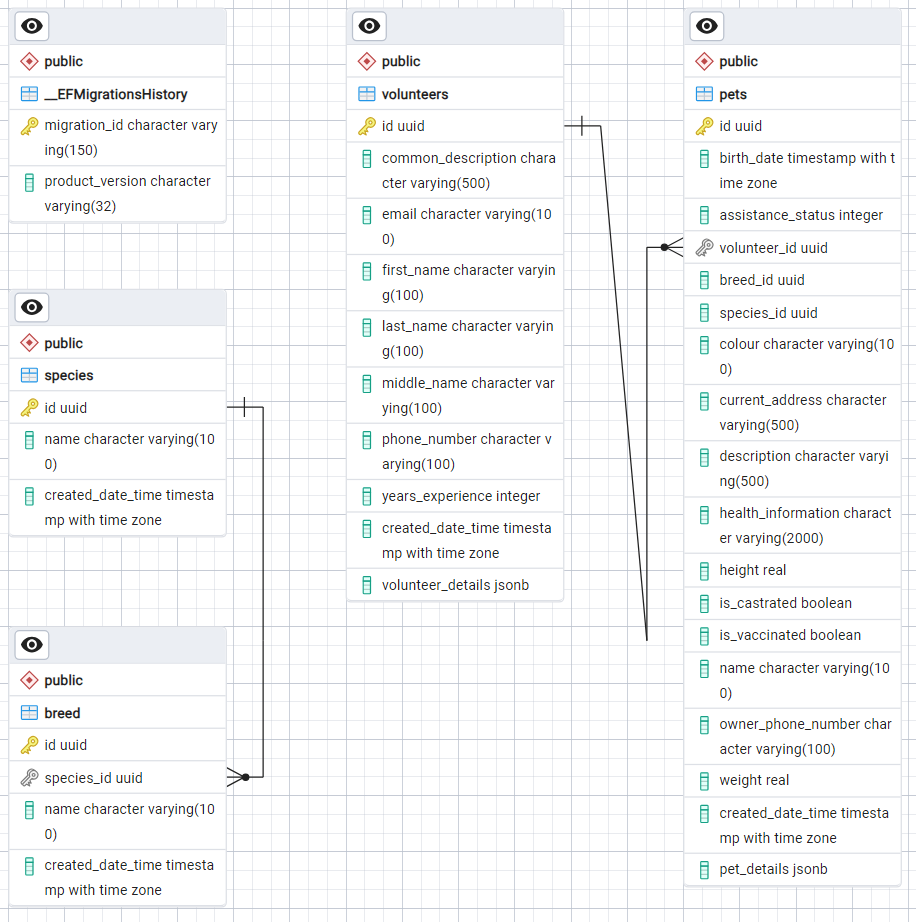

# PetBrothers

## Диаграмма БД

## Запуск 

1. Добавить секреты 

из `src\PetBrothers.API`
выполнить `dotnet user-secrets set "ConnectionStrings:Database" "Server=localhost;Port=5434;Database=pet_brothers;User Id=postgres;Password=postgres;"`